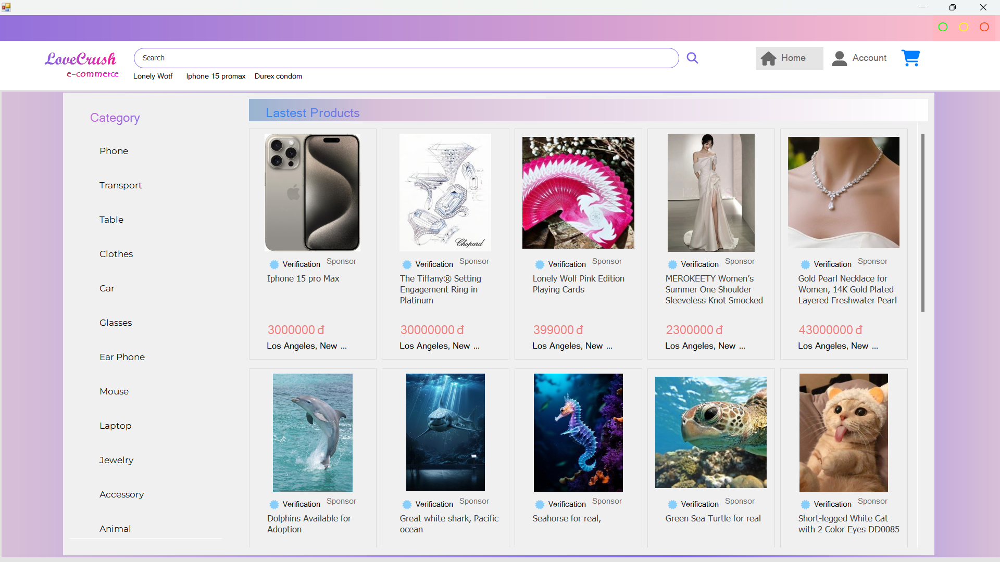
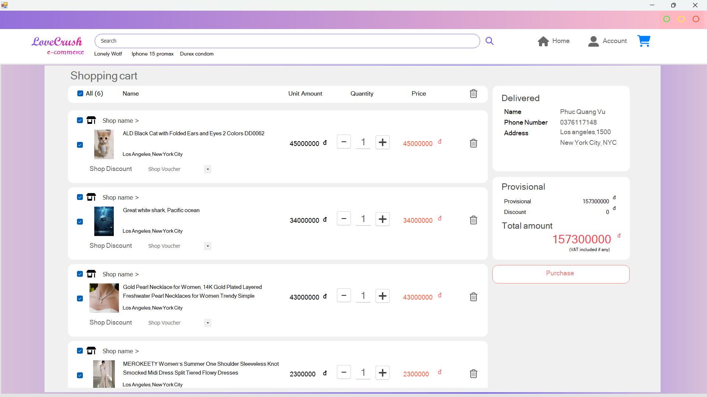
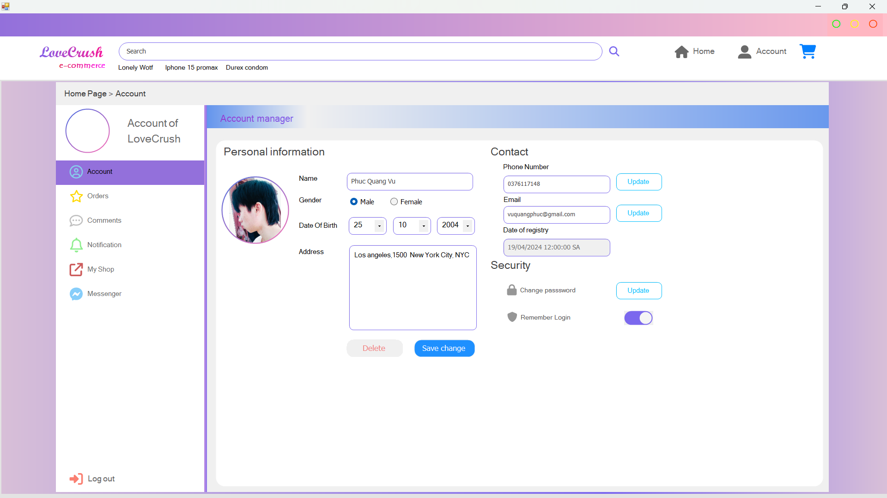

# LovE-Commerce Management System

### 124221 - Final winforms project

Author : LoveCrush

Time : almost 2 months

---

### Motivation

This project has been upgraded from my first winform project last year, you can find it in my repo with the same signature.

I know this platform is not mean for us to creating something like this, It should be designed on web page or something else properly, But let's say I finally made it on winforms, not perfect but I proud of it.

This project almost took me two months for coding and designing system. It was a long trip.

I have a big interest in those e-commerces out there, especially Tiki, Amazon, Shoppee,..

### What's new in this version

* Dynamic form naviagation
* Control Generation
* Image path relative processing
* Modern GUI

### Knowledge requirements

- LINQ
- Extension method
- Async await
- Lamda Expression
- Anoymous method
- Anonymous object
- IEnumerable<>, IQueryable<>, yield return
- Genneric
- Control Generation
- Nested form
- Delegate, Event

### Demonstration

Home page GUI

Shopping Cart GUI

Customer Information GUI

### How to use my project

To use this project you need to make sure these things still work fine.

SQL Sever

Visual Studio ( .Net framework, winforms framework)

Soure code

### How to get the server

I've tried containerize this sql sever and recovery it with my bakup file, but seem like it's not work.

I put the bak file  in the docker folder, If you want to recovery it, just do it yourself, I recommend you do it on sqlsever management system for good, I'm not an expert in this area.

After all of that you just need some little configuration with my conection String, change some server, database name, password,... And the application'll work properly.

'Cause I'm not able to deploy the sql server so It might be recovery manual, just down load the the backup file and recovery the database.
